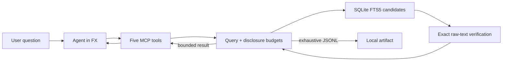

# Bounded Retrieval

> A reference implementation for investigating large conversational datasets while keeping model-visible retrieval bounded.

This repository demonstrates one idea: **the amount of data examined by the system should be independent of the amount of data shown to the model**.

The corpus is deterministic, synthetic Slack-style sales conversation data. It never accepts Slack exports and does not connect to Slack. SQLite may scan or index thousands of messages, while the MCP server returns counts, compact evidence, or an artifact reference under fixed byte limits.

This is an open-source reference demonstration—not a supported product, hosted service, reusable library, or general Slack integration. There is intentionally no license yet.

## What it proves

- Exact lexical counts do not require moving message bodies through the model.
- Qualitative investigation can progress from ranked evidence to representative samples and selected thread context.
- An unreliable agent cannot ask the server to exceed per-result or cumulative disclosure limits.
- Exhaustive results can be exported locally without entering model context.
- The harness, model, and storage/index implementation remain replaceable.



## Run it

Prerequisites are pinned deliberately:

- Node 24.20.0
- pnpm 11.18.0, installed natively
- FX 0.0.7 for the interactive demo

Install project dependencies and verify the implementation:

```sh
pnpm install
pnpm check
```

Generate a realistic week of 10,000 synthetic messages:

```sh
pnpm seed -- --profile week
```

Run the reproducible comparison. Its default is a realistic month of 40,000 messages so the naïve response is large enough to demonstrate the failure mode:

```sh
pnpm evaluate -- --force
```

The command creates ignored SQLite, ground-truth, and JSON evaluation artifacts under `artifacts/`. It makes no model or provider call.

Install the pinned FX binary using [FX Installation — Review the installer before running it](https://fx.sh/docs/getting-started/installation#review-the-installer-before-running-it), then launch the project through pnpm:

```sh
curl -fsSL https://fx.sh/setup.sh | bash -s -- v0.0.7
pnpm fx
```

The runner checks the exact Node and FX versions, disables FX auto-upgrades for the process, creates the default week corpus when needed, and then launches FX. It never downloads FX itself. Review the installer first if your environment requires it; FX documents that the release archive currently has no published signature or checksum.

FX treats project MCP configuration as untrusted until you approve it. Review `.mcp.json`, then approve only this server in the FX shell:

```text
/mcp trust approve bounded-retrieval
```

That trust decision remains in your private FX settings, not in this repository. See [FX: project MCP configuration and trust](https://fx.sh/docs/capabilities/mcp#project-configuration-and-trust).

## Try the demonstration

Choose one instruction profile and give it to the agent before the question:

- [`instructions/neutral.md`](instructions/neutral.md) explains the realistic environment without prescribing a retrieval strategy.
- [`instructions/guided.md`](instructions/guided.md) teaches the intended progressive-disclosure strategy.

Then ask:

```text
How often did OpenAI come up? Distinguish occurrences, messages, threads, and conversations.
```

The efficient path is one `measure_messages` call and no message text.

For a qualitative run, ask:

```text
What concerns did clients raise about OpenAI? Group the themes and cite the message references supporting each theme.
```

The expected shape is bounded discovery, optional representative sampling, and selective context expansion—not pagination through every result. A recording outline is in [`docs/video-demo.md`](docs/video-demo.md).

## Reference results

`pnpm evaluate -- --force` produced these deterministic measurements for the 40,000-message month fixture (`corpus-4f6e4a3f4bb9439c`):

| Question | Strategy | Tool calls | Model-visible result bytes | Reduction vs. naïve |
| --- | --- | ---: | ---: | ---: |
| How often did OpenAI come up? | Bounded measurement | 1 | 4,084 | 99.62% |
| What concerns did clients raise? | Discover + sample + expand | 3 | 24,434 | 97.71% |
| Either question | Naïve full-row regex | 1 | 1,069,038 | — |

The naïve baseline scans all 40,000 rows and returns all 1,159 matching denormalized messages. The bounded and naïve byte totals both measure the complete MCP-compatible response, including `structuredContent` and its text compatibility representation.

These numbers are retrieval measurements, not a claim about model quality. No model was called. A live FX run can still make unnecessary tool calls or produce a poor synthesis; that remaining uncertainty is the agent-engineering problem this server constrains rather than pretending to solve.

## Tool surface

| Tool | Purpose | Key boundary |
| --- | --- | --- |
| `measure_messages` | Exact counts and time distribution | No message text; 4 KiB |
| `discover_messages` | Ranked, thread-diverse evidence | At most 8 snippets; 16 KiB |
| `sample_messages` | Test representativeness across a distribution | New evidence, not pagination; 16 KiB |
| `expand_message_context` | Recover one selected thread or nearby conversation | Disclosed anchors only; 20 messages and 12 KiB |
| `export_messages` | Materialize every exact row as JSONL | Metadata only in context; rows stay on disk |

Equivalent normalized queries share one process-scoped `query_ref` and a 48 KiB cumulative disclosure budget. Requested limits can be lower, never higher. Errors, truncation, and incomplete scans remain explicit.

Sampling stays separate from ranked discovery because they answer different questions. Ranking asks “what looks most relevant?” Sampling asks “is that top-ranked evidence representative?” Combining them would hide that distinction from the agent and from evaluation.

## Corpus and search semantics

The canonical data is one denormalized `messages` table containing message, sender, conversation, thread, reply, and timestamp fields. Sender and conversation metadata is intentionally duplicated on every row. Internal generator metadata and an FTS5 virtual index support reproducibility and candidate retrieval; there are no normalized user or conversation tables.

Profiles:

| Profile | People | Span | Messages | Intent |
| --- | ---: | ---: | ---: | --- |
| `week` | 20 | 7 days | 10,000 | Default interactive demo |
| `month` | 20 | 30 days | 40,000 | Default deterministic evaluation |
| `million` | 20 | 30 days | 1,000,000 | Artificial scale fixture |
| `stress` | 20 | 30 days | 10,000,000 | Artificial stress fixture |

The synthetic ground truth is stored beside the database but is never read by the MCP server. It includes exact OpenAI counts and concern-category support IDs for evaluation.

FTS5 retrieves candidates; raw message text determines truth. Literal `OpenAI` matching is case-insensitive and Unicode-boundary aware. `Open AI`, `Open-AI`, `OpenAÍ`, and `ChatGPT` do not silently count as literal matches. Aliases must be explicit query clauses and retain separate provenance.

## Project boundaries

V1 deliberately excludes real Slack ingestion, authentication, hosted deployment, UI work beyond FX, embeddings, vector search, semantic counts, CI, and multi-model benchmarking. The model will be selected later from AI Gateway; it is not baked into the query layer.

For the research behind these choices—including OpenAI, Anthropic, VS Code, Copilot, MCP, SQLite, and FX behavior—see [`docs/research.md`](docs/research.md).

## Source map

- `src/corpus/`: deterministic message generator and separate ground truth
- `src/retrieval/`: structured queries, FTS candidate retrieval, exact verification, ranking, sampling, and context reconstruction
- `src/session/`: process-scoped query references and cumulative disclosure accounting
- `src/service/`: bounded orchestration and full-result byte measurement
- `src/mcp/`: strict schemas and the five-tool stdio server
- `src/evaluation/`: naïve baseline and deterministic comparison
- `src/export/`: streaming local JSONL exports
