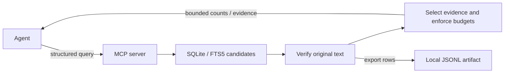

# Bounded Retrieval

A local reference demonstration of efficient MCP tools for investigating large conversational datasets. It uses deterministic, synthetic Slack-style sales messages and a SQLite-backed MCP server.

The idea: **the amount of data examined should be independent of the amount shown to the model.** Search and count on the server; give the agent compact evidence it can use to answer the question or decide what to investigate next.

## Purpose and goals

Returning every matching row fills context with repeated metadata and irrelevant text. Reducing that output only helps if the agent still receives the evidence needed for the task.

This project explores how to:

- Reduce tool calls and context bytes while retaining useful, attributable evidence.
- Answer exact frequency questions without returning message bodies.
- Support discovery with relevant excerpts, representative samples, and selected context.
- Enforce disclosure limits even when the agent makes redundant or poor requests.

The agent interprets intent and chooses its next step. The server handles deterministic retrieval, measurement, filtering, ranking, sampling, and budgeting.

## How the approach works

Five tools let the agent request information by purpose. Discovery already includes counts, so measurement is optional. Sampling checks beyond ranked evidence; context expansion helps interpret selected messages. Neither is a mandatory follow-up.

| Tool | What it provides | Boundary |
| --- | --- | --- |
| `measure_messages` | Counts of occurrences, messages, threads, and conversations; time distribution | No message text; 4 KiB |
| `discover_messages` | Ranked excerpts diversified by full text and thread | At most 8 snippets; 16 KiB |
| `sample_messages` | Previously undisclosed messages sampled uniformly or across time/conversations | Seeded sampling, not pagination; 16 KiB |
| `expand_message_context` | Thread or nearby conversation context for a disclosed anchor | At most 20 messages; 12 KiB |
| `export_messages` | Exhaustive exact rows in a local JSONL artifact | Metadata only in context; 16 KiB |



Every serialized MCP result fits within **16 KiB**, including structured content and its text compatibility copy. Equivalent normalized queries share a **48 KiB cumulative disclosure budget** for the server process's lifetime. Requested limits can be lower, never higher. The server enforces these reference limits before the host receives a result.

Results preserve attribution, match provenance, stable evidence references, and explicit incomplete, rejected, or clipped outcomes. Samples do not estimate theme prevalence, and exhausting a result set does not certify semantic completeness. The [version 2 response contract](docs/discovery-results.md#response-contract-version-2) explains query references, repeat counts, sampling populations, and omission rules.

## Why the MCP is designed this way

- **Separate tools for separate decisions.** Counting needs no message bodies. Ranked discovery and sampling answer different questions: useful evidence versus possible selection bias. Context and export have their own disclosure rules. Keeping these contracts explicit helps the agent choose the right operation.
- **Counts travel with discovery.** An agent investigating a theme can get evidence and understand the matching population in one call. It need not measure first or follow a fixed discover/sample/expand sequence.
- **Structured queries keep intent with the agent.** The agent chooses terms and filters; the server applies exact lexical rules. Strict schemas and explicit alias provenance make that behavior inspectable without another model interpreting the request inside the tool.
- **Compact evidence preserves the next decision.** Citations, attribution, timestamps, repeat counts, and clipping flags help the agent judge whether to answer, refine, sample, or expand. Full-text and thread diversity reduce redundant excerpts without hiding who said what.
- **Query references preserve context and accounting.** Follow-up calls reuse the same normalized query and disclosure budget. Only disclosed message references authorize expansion, so context retrieval stays connected to evidence the agent actually received.
- **The server owns the limits.** Full-response byte caps apply before results reach FX or another host. Explicit incomplete and truncated states prevent a small response from masquerading as an exhaustive answer. Host compaction is not required for the MCP to remain bounded.

## Research behind the approach

The design draws on published tool and retrieval documentation:

- **Small, clear tool surfaces and useful responses.** [OpenAI's function-design guidance](https://developers.openai.com/api/docs/guides/function-calling#best-practices-for-defining-functions) recommends intuitive functions and moving known work into code. [Anthropic's tool-definition guidance](https://platform.claude.com/docs/en/agents-and-tools/tool-use/define-tools#best-practices-for-tool-definitions) favors high-signal results with stable identifiers. We use five distinct retrieval contracts and avoid a mandatory chain of calls.
- **Account for the actual response.** The [MCP structured-content contract](https://modelcontextprotocol.io/specification/2025-11-25/server/tools#structured-content) recommends a compatibility text representation alongside structured content. We budget both, before host-specific context handling.
- **An index match is not raw-text truth.** [SQLite's Unicode61 tokenizer](https://www.sqlite.org/fts5.html#unicode61_tokenizer) normalizes case, diacritics, and separators. We verify original text so lexical counts and explicit aliases retain their intended meanings.

These sources motivate the design; the experiments below test this implementation. The [research notes](docs/research.md) connect sources to decisions in more detail, including pagination, context management, and FX.

## Evidence and benchmarks

### Brief live FX example

Two fresh FX 0.0.7 sessions used `openai/gpt-5.6-luna`, the same 10,000-message week
corpus, and the same request for two client concerns. Both cited the same verified
evidence for pricing predictability and vendor lock-in.

| Live run | Retrieval + FX discovery calls | Tool-output bytes | Session elapsed |
| --- | ---: | ---: | ---: |
| Default FX and project context | 3 + 3 | 39,289 | 42.9 s |
| With the existing guided instructions | 2 + 2 | 27,273 | 20.6 s |

The guided run used **2 fewer total calls and 30.58% fewer tool-output bytes**, with
2,211 additional prompt bytes. It avoided an unnecessary context expansion. This
is one run per condition, not a reliable latency or general agent-quality benchmark;
per-run model tokens and cost were unavailable.

The final discovery reply was also **87.30% smaller** than an offline full-row
reply for the same 105 matching messages. The [saved FX runs and analysis](docs/fx-results.md)
include both answers, exact calls, all byte accounting, and comparison limits.

### Deterministic retrieval benchmarks

The default evaluation uses **40,000 synthetic messages**, seed `bounded-retrieval-evaluation-v1`, and corpus `corpus-4f6e4a3f4bb9439c`. It makes no model or provider call.

| Retrieval strategy | Calls | Total response bytes | Reduction vs. naïve |
| --- | ---: | ---: | ---: |
| Naïve full-row regex | 1 | 1,069,038 | N/A |
| Exact frequency measurement | 1 | 4,086 | 99.62% |
| Three explicit lexical refinements for client concerns | 3 | 17,122 | 98.40% |

The naïve baseline scans all 40,000 rows and returns 1,159 matching messages. It exists only in evaluation. Both sides count full MCP-compatible result bytes, including both representations; the three-call figure is a total across individually bounded results.

The refined recipe retrieves visible support for **all five planted concern categories**. Against the corrected pre-optimization version of that same recipe, response bytes fell from 45,564 to 17,122 (**62.42%**) and coverage rose from four categories to five. Call count stayed at three. Matching and sampling corrections, compact schemas, duplicate-aware discovery, and context fitting are documented in the [implementation results](docs/discovery-results.md).

The recipe is hand-authored and fixture-informed. Broad ranked discovery finds only two categories, and the former fixed discover/sample/expand sequence finds none. These benchmarks establish deterministic retrieval behavior; the brief live example above separately records one agent's choices and answer. Neither establishes language generalization or model-token savings. Reducing call count remains a goal; the implementation comparison demonstrates fewer response bytes and better evidence coverage.

## Apply this to your own MCP

Use this repository as a worked example of tool contracts and evaluation. Your
server can use another database, domain, or host; the useful pattern is to do the
large retrieval work outside model context and disclose enough evidence for the
agent's next decision. Choose tool boundaries and budgets for your workload. The
five tools and 16/48 KiB limits here are reference choices.

1. **Start with one task and a definition of success.** Choose a question agents
   actually need to answer. Write down the required facts, citations, and limits
   on what the answer may claim. Build a small evaluation set with known answers,
   including duplicates, rare evidence, empty results, and incomplete retrieval.
   That gives you a way to detect when a smaller response has lost useful evidence.

2. **Build the smallest useful operation first.** A counting question needs
   aggregation, not records. An investigation needs selected evidence and enough
   information about the matching population to interpret it. Include cheap counts
   with discovery when that avoids a predictable extra call; add sampling, context,
   or export only when a task needs them.

3. **Design the response around the agent's next decision.** For an issue-tracker
   MCP answering “What is blocking this release?”, return issue IDs, owners,
   status, update times, and short supporting excerpts. Let the agent fetch a
   selected discussion when necessary. Define input and output schemas, preserve
   active filters and provenance, and distinguish complete counts from partial
   evidence. The [SDK structured-output example](https://ts.sdk.modelcontextprotocol.io/v2/servers/tools)
   shows the schema and result mechanism used here.

4. **Enforce limits at the serialization boundary.** Measure the complete result,
   including compatibility text and SDK-added fields; a row limit alone cannot
   bound long or Unicode-heavy records. Fit the output before transmission and
   report what was omitted. If follow-up calls reuse a query, bind their references
   to that query and data version, account for cumulative disclosure, and define
   what happens when a reference expires or its budget runs out. Measure host
   wrapping separately rather than assuming the server's counter covers it.

5. **Compare whole investigations, with quality held accountable.** Save a baseline
   before changing selection or formatting. First compare identical evidence in
   smaller representations; then test whether different selection preserves or
   improves support for the answer. Track all calls, output bytes, added prompt
   bytes, latency, and actual model usage when available. Keep failures and missing
   evidence visible alongside savings.

6. **Test the tools through a real agent and host.** Inspect whether the agent
   chooses the right filters, requests unnecessary context, or spends calls finding
   tools. Our FX runs exposed all three costs. Put useful field-selection examples
   and stopping guidance into tool descriptions or agent instructions, then compare
   fresh sessions on the same tasks. Repeat across different wording and datasets
   before treating a gain as general. Smaller server responses and better agent
   decisions are separate things to verify.

For implementation, study the [schemas](src/mcp/schemas.ts) and
[tool descriptions](src/mcp/server.ts), the [result serializer](src/service/result-envelope.ts)
and [budget orchestration](src/service/bounded-retrieval-service.ts), then the
[query registry](src/session/query-registry.ts). Adapt the
[evidence-quality scoring](src/evaluation/evidence-quality.ts) to your own success
criteria, and use the [FX comparison](docs/fx-results.md) as an example of reporting
both gains and remaining inefficiencies. This reference is not packaged as a
reusable library; these are starting points to adapt and validate in your server.

## Test and reproduce the results

Use **Node 24.20.0** and **native pnpm 11.18.0**. From the repository root:

```sh
pnpm install --frozen-lockfile
pnpm check
pnpm evaluate -- --force
```

FX and provider credentials are unnecessary for these checks. The [running guide](docs/running.md#runtime-and-dependencies) explains the pinned runtime and installation requirements.

Expected results:

- `pnpm check` passes type checking and **41 tests**, including real MCP stdio calls to all five tools. Tests cover exact matching, sampling, attribution, byte fitting, cumulative budgets, and anchor access.
- The evaluator exits successfully with **all five assertions true**: exact counts match ground truth, every bounded result fits its cap, frequency bytes fall by at least 90%, query budgets hold, and the refined recipe covers all five concern categories.
- `artifacts/evaluations/month.json` contains the benchmark totals above, call traces, and supported/missing categories. `--force` regenerates the evaluation corpus and ground truth; generated artifacts are ignored by Git. Timings and process-scoped references can vary.

Use this sequence when assessing changes: preserve correctness and evidence coverage, then compare bytes and calls. Additional seed checks and saved before/after artifacts are linked in the [verification report](docs/discovery-results.md#verification).

## Explore further

- [Running guide](docs/running.md): corpus profiles, optional FX 0.0.7 setup, neutral/guided prompts, and source map.
- [Implementation results](docs/discovery-results.md): measured comparisons, current response semantics, and remaining questions.
