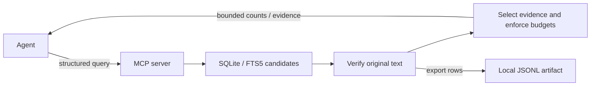

# Bounded Retrieval

A local reference demonstration of efficient MCP tools for investigating large conversational datasets. It uses deterministic, synthetic Slack-style sales messages and a SQLite-backed MCP server.

The idea: **the amount of data examined should be independent of the amount shown to the model.** Search and count on the server; give the agent compact evidence it can use to answer the question or decide what to investigate next.

## Purpose and goals

Returning every matching row fills context with repeated metadata and irrelevant text. Reducing that output only helps if the agent still receives the evidence needed for the task.

This project explores how to:

- Reduce tool calls and context bytes while retaining useful, attributable evidence.
- Answer exact frequency questions without returning message bodies.
- Support discovery with relevant excerpts, representative samples, and selected context.
- Enforce disclosure limits even when the agent makes redundant or poor requests.

The agent interprets intent and chooses its next step. The server handles deterministic retrieval, measurement, filtering, ranking, sampling, and budgeting.

## How the approach works

Five tools let the agent request information by purpose. Discovery already includes counts, so measurement is optional. Sampling checks beyond ranked evidence; context expansion helps interpret selected messages. Neither is a mandatory follow-up.

| Tool | What it provides | Boundary |
| --- | --- | --- |
| `measure_messages` | Counts of occurrences, messages, threads, and conversations; time distribution | No message text; 4 KiB |
| `discover_messages` | Ranked excerpts diversified by full text and thread | At most 8 snippets; 16 KiB |
| `sample_messages` | Previously undisclosed messages sampled uniformly or across time/conversations | Seeded sampling, not pagination; 16 KiB |
| `expand_message_context` | Thread or nearby conversation context for a disclosed anchor | At most 20 messages; 12 KiB |
| `export_messages` | Exhaustive exact rows in a local JSONL artifact | Metadata only in context; 16 KiB |



Every serialized MCP result fits within **16 KiB**, including structured content and its text compatibility copy. Equivalent normalized queries share a **48 KiB cumulative disclosure budget** for the server process's lifetime. Requested limits can be lower, never higher. The server enforces these reference limits before the host receives a result.

Results preserve attribution, match provenance, stable evidence references, and explicit incomplete, rejected, or clipped outcomes. Samples do not estimate theme prevalence, and exhausting a result set does not certify semantic completeness. The [version 2 response contract](docs/discovery-results.md#response-contract-version-2) explains query references, repeat counts, sampling populations, and omission rules.

## Why the project is set up this way

- **Synthetic data with separate ground truth** makes counts and evidence coverage reproducible. The MCP server never reads the evaluation labels, accepts Slack exports, or connects to Slack.
- **One denormalized SQLite `messages` table plus FTS5** keeps the dataset inspectable and exposes the cost of returning full rows. The index retrieves candidates; original text defines exact matches. Aliases remain explicit. See [corpus and matching details](docs/running.md#corpus-profiles).
- **A local server and replaceable FX harness** separate retrieval behavior from model and UI choices. Host compaction and truncation are not the safety boundary. Exact runtime and dependency pins make the experiment reproducible.

This is a reference demonstration, not a supported product or reusable library. V1 excludes real ingestion, authentication, hosted deployment, custom UI, embeddings, vector search, semantic counts, CI, and multi-model benchmarking. No license has been selected yet.

## Research behind the approach

The design draws on published tool and retrieval documentation:

- **Small, clear tool surfaces and useful responses.** [OpenAI's function-design guidance](https://developers.openai.com/api/docs/guides/function-calling#best-practices-for-defining-functions) recommends intuitive functions and moving known work into code. [Anthropic's tool-definition guidance](https://platform.claude.com/docs/en/agents-and-tools/tool-use/define-tools#best-practices-for-tool-definitions) favors high-signal results with stable identifiers. We use five distinct retrieval contracts and avoid a mandatory chain of calls.
- **Account for the actual response.** The [MCP structured-content contract](https://modelcontextprotocol.io/specification/2025-11-25/server/tools#structured-content) recommends a compatibility text representation alongside structured content. We budget both, before host-specific context handling.
- **An index match is not raw-text truth.** [SQLite's Unicode61 tokenizer](https://www.sqlite.org/fts5.html#unicode61_tokenizer) normalizes case, diacritics, and separators. We verify original text so lexical counts and explicit aliases retain their intended meanings.

These sources motivate the design; the experiments below test this implementation. The [research notes](docs/research.md) connect sources to decisions in more detail, including pagination, context management, and FX.

## Evidence and benchmarks

The default evaluation uses **40,000 synthetic messages**, seed `bounded-retrieval-evaluation-v1`, and corpus `corpus-4f6e4a3f4bb9439c`. It makes no model or provider call.

| Retrieval strategy | Calls | Total response bytes | Reduction vs. naïve |
| --- | ---: | ---: | ---: |
| Naïve full-row regex | 1 | 1,069,038 | — |
| Exact frequency measurement | 1 | 4,086 | 99.62% |
| Three explicit lexical refinements for client concerns | 3 | 17,122 | 98.40% |

The naïve baseline scans all 40,000 rows and returns 1,159 matching messages. It exists only in evaluation. Both sides count full MCP-compatible result bytes, including both representations; the three-call figure is a total across individually bounded results.

The refined recipe retrieves visible support for **all five planted concern categories**. Against the corrected pre-optimization version of that same recipe, response bytes fell from 45,564 to 17,122 (**62.42%**) and coverage rose from four categories to five. Call count stayed at three. Matching and sampling corrections, compact schemas, duplicate-aware discovery, and context fitting are documented in the [implementation results](docs/discovery-results.md).

The recipe is hand-authored and fixture-informed. Broad ranked discovery finds only two categories, and the former fixed discover/sample/expand sequence finds none. These results establish deterministic retrieval behavior, not unaided agent quality or language generalization. Actual model tokens, tool-definition overhead, and final answer quality remain unmeasured. Reducing call count remains a goal; this optimization demonstrates fewer response bytes and better evidence coverage.

## Test and reproduce the results

Use **Node 24.20.0** and **native pnpm 11.18.0**. From the repository root:

```sh
pnpm install --frozen-lockfile
pnpm check
pnpm evaluate -- --force
```

FX and provider credentials are unnecessary for these checks. The [running guide](docs/running.md#runtime-and-dependencies) explains the pinned runtime and installation requirements.

Expected results:

- `pnpm check` passes type checking and **41 tests**, including real MCP stdio calls to all five tools. Tests cover exact matching, sampling, attribution, byte fitting, cumulative budgets, and anchor access.
- The evaluator exits successfully with **all five assertions true**: exact counts match ground truth, every bounded result fits its cap, frequency bytes fall by at least 90%, query budgets hold, and the refined recipe covers all five concern categories.
- `artifacts/evaluations/month.json` contains the benchmark totals above, call traces, and supported/missing categories. `--force` regenerates the evaluation corpus and ground truth; generated artifacts are ignored by Git. Timings and process-scoped references can vary.

Use this sequence when assessing changes: preserve correctness and evidence coverage, then compare bytes and calls. Additional seed checks and saved before/after artifacts are linked in the [verification report](docs/discovery-results.md#verification).

## Explore further

- [Running guide](docs/running.md): corpus profiles, optional FX 0.0.7 setup, neutral/guided prompts, and source map.
- [Video demonstration](docs/video-demo.md): show the deterministic comparison, then observe a live agent.
- [Discovery design](docs/discovery-design.md): the reviewed plan and historical projections; [implementation results](docs/discovery-results.md) record what was actually achieved and what remains open.
