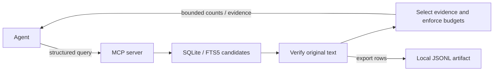

# Bounded Retrieval

Bounded Retrieval explores how an MCP server can search a large dataset while
returning limited evidence to an agent. The server counts and filters records,
selects excerpts, and enforces output budgets before returning a result. This local
reference uses synthetic Slack-style messages to measure how those choices affect
response size and evidence coverage.

https://github.com/user-attachments/assets/1f5eea25-f12a-454e-bd0f-b21ae71b7d17

## Problem

The amount of data examined should be independent of the amount shown to the model.
Returning every matching record fills context with repeated metadata and irrelevant
text. Cutting the response to a few rows can discard the evidence needed to answer.

A useful retrieval tool must do both: limit what it returns and preserve enough
information for the agent to answer, refine its query, or request more context.
This project tests that tradeoff on questions about client concerns in a sales
conversation dataset.

## Design

The agent interprets the question and chooses terms and filters. The server applies
those structured queries to SQLite, verifies matches against original message
text, and selects evidence within a byte budget. No model runs inside the server.

```mermaid
flowchart LR
    A["Agent"] -->|"structured query"| S["MCP server"]
    S --> D["SQLite / FTS5 candidates"]
    D --> V["Verify original text"]
    V --> B["Select evidence and enforce budgets"]
    B -->|"bounded counts / evidence"| A
    V -->|"export rows"| E["Local JSONL artifact"]
```

Each tool answers a different retrieval need:

| Tool | Returns | Limit |
| --- | --- | --- |
| `measure_messages` | Exact counts and time distribution, without message text | 4 KiB |
| `discover_messages` | Counts and ranked excerpts, diversified by full text and thread | 8 snippets; 16 KiB |
| `sample_messages` | Previously undisclosed messages sampled uniformly or across time/conversations | 16 KiB |
| `expand_message_context` | Thread or nearby context for a disclosed message | 20 messages; 12 KiB |
| `export_messages` | A local JSONL artifact reference, without exported rows inline | 16 KiB |

Discovery includes counts, so the agent need not measure first. Sampling checks
beyond the ranked selection. Expansion helps interpret a particular message.
These are options, not a required sequence.

Evidence includes sender and conversation attribution, timestamps, stable
references, and clipping flags. Duplicate groups compare full text before clipping;
a representative's attribution applies only to that message. FTS5 supplies
candidates, but original text determines lexical matches and counts. The
[research notes](docs/research.md) explain the source guidance behind these choices.

The server limits every result to at most 16 KiB and charges equivalent normalized
queries to a shared 48 KiB disclosure budget for the server process's lifetime.
Distinct queries have separate budgets, so this is not a whole-investigation cap.
Repeated requests consume that budget. Only message references actually returned
to the agent authorize context expansion.

Byte accounting includes structured content and its compatibility text copy, as
shown in [SDK v2: Register a tool with structured output](https://ts.sdk.modelcontextprotocol.io/v2/servers/tools).
The server fits the result before transmission. SDK metadata and host wrapping
are measured separately in the live experiment. The
[response reference](docs/discovery-results.md) defines completion, omissions, and
budget accounting.

## Example investigation

Consider the question, "What concerns did clients raise about OpenAI?"

In a saved live run, the agent first searched client messages containing both
`OpenAI` and `concern`. The returned evidence supported pricing predictability.
It then broadened the query to `OpenAI`, keeping the client-sender filter, and
found evidence about switching providers later.

That final query matched 105 messages. Discovery returned selected excerpts with
citations rather than all 105 rows. Its reply was 12,423 bytes in FX, compared with
97,823 bytes for an offline full-row reply using the same matching population and
wrapping. The excerpts supported both requested concerns without expansion.

The answer identified two concerns. It did not establish their prevalence or claim
to cover every concern. The [saved experiment](docs/evaluation.md#live-agent-example)
contains the calls, citations, and comparison method.

## Results

The default deterministic evaluation uses 40,000 synthetic messages and makes no
model or provider call. It measures complete MCP-compatible response bytes and
checks visible evidence against separate ground-truth labels.

| Retrieval | Calls | Response bytes | What the result establishes |
| --- | ---: | ---: | --- |
| Naive full-row regex baseline | 1 | 1,069,038 | Returns all 1,159 matching messages |
| Frequency measurement | 1 | 4,086 | Exact counts match ground truth |
| Broad client-concern discovery | 1 | 13,922 | Visible support for 2 of 5 planted categories |
| Three explicit lexical refinements | 3 | 17,122 | Visible support for 5 of 5 planted categories |

Frequency measurement uses 99.62% fewer bytes than the full-row baseline. The
refined investigation uses 98.40% fewer bytes, but its queries are hand-authored
from knowledge of the fixture. These results demonstrate retrieval behavior and
output size, not an unaided agent's ability to find every theme.

Two separate live FX sessions asked for two concerns from a 10,000-message corpus.
Both supplied supported citations. Added retrieval guidance reduced total calls
from six to four and tool-output bytes from 39,289 to 27,273, with 2,211 additional
prompt bytes. There was only one session per condition. See the
[evaluation report](docs/evaluation.md) for methods, detailed comparisons, and saved
records.

## Limitations

All data is synthetic. The deterministic recipes use known wording, and seed
checks reuse those wording templates. Broad discovery misses three planted
categories; the former fixed discovery/sample/expansion sequence finds none.
Across three additional seeds, discovery plus sampling supported only two or three
categories, while the fixture-informed refinements supported all five. Extra calls
and small responses alone do not establish a successful investigation. See the
[seed checks](docs/evaluation.md#additional-seed-checks).

A complete lexical scan does not establish semantic completeness. Samples do not
estimate theme prevalence. The server reports incomplete scans, clipped evidence,
and rejected requests explicitly, but the agent must interpret those states.

The live runs do not establish general improvements in agent quality or latency.
A [broader live investigation](docs/evaluation.md#broader-live-investigation) used
five retrieval calls but covered only one of the five planted categories. It
searched for the word `client` instead of filtering client senders. Both final
citations were supported, including a vendor-approval topic outside the planted
labels, but the investigation missed most labelled concerns. Bounded output did
not ensure useful query choices.

Per-run model tokens and cost were unavailable. Output bytes count each response
once and do not measure repeated inclusion in later model requests.

## Applying the approach

Choose operations around the decisions your agent needs to make. A frequency
question needs counts; an investigation needs attributable evidence and a way to
resolve gaps. The five tools and exact budgets here are workload-specific choices.

Enforce limits on serialized output, preserve citations and omission information,
and account for repeated disclosure. Start with the
[result serializer](src/service/result-envelope.ts),
[budget orchestration](src/service/bounded-retrieval-service.ts), and
[query registry](src/session/query-registry.ts). The
[schemas](src/mcp/schemas.ts) and [tool descriptions](src/mcp/server.ts) show how
those rules reach the agent.

Evaluate evidence coverage alongside bytes and calls. Adapt the
[evidence scoring](src/evaluation/evidence-quality.ts) to questions with known
answers, then inspect actual agent traces for poor filters and unnecessary calls.
This repository is a worked reference, not a packaged library.

## Reproduction

The [running guide](docs/running.md) covers pinned dependencies, deterministic
checks, corpus generation, and the optional FX demo. The default evaluation checks
exact counts, response caps, query budgets, frequency byte reduction, and coverage
of all five categories by the refined recipe.
